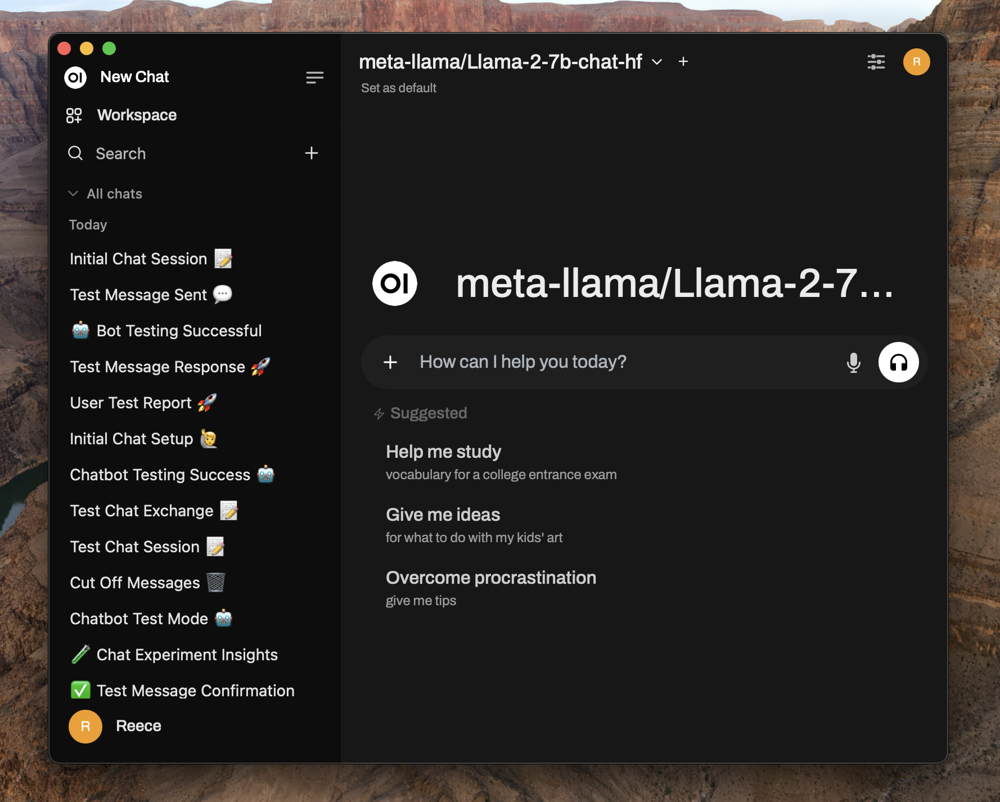
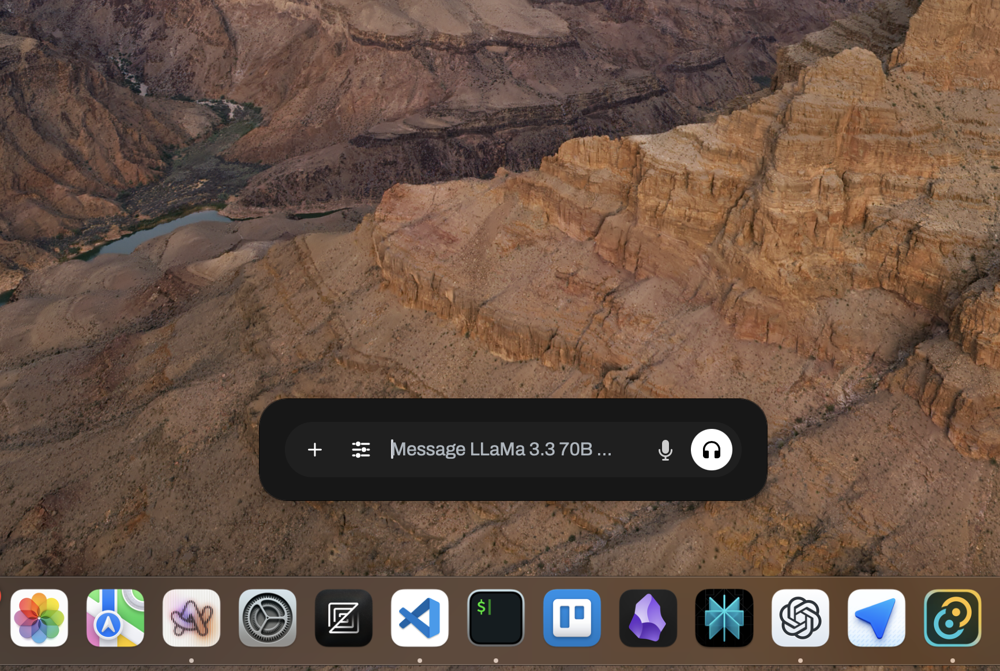
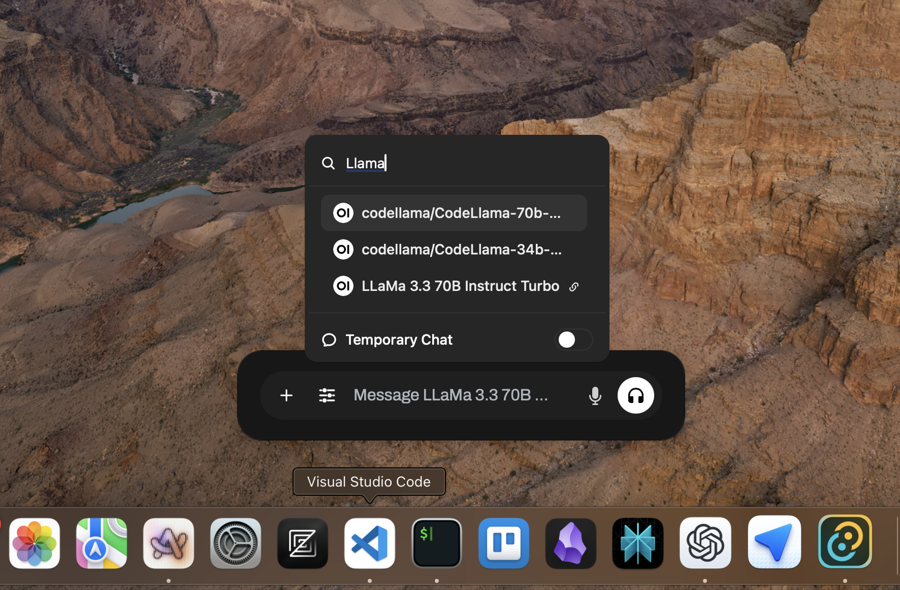
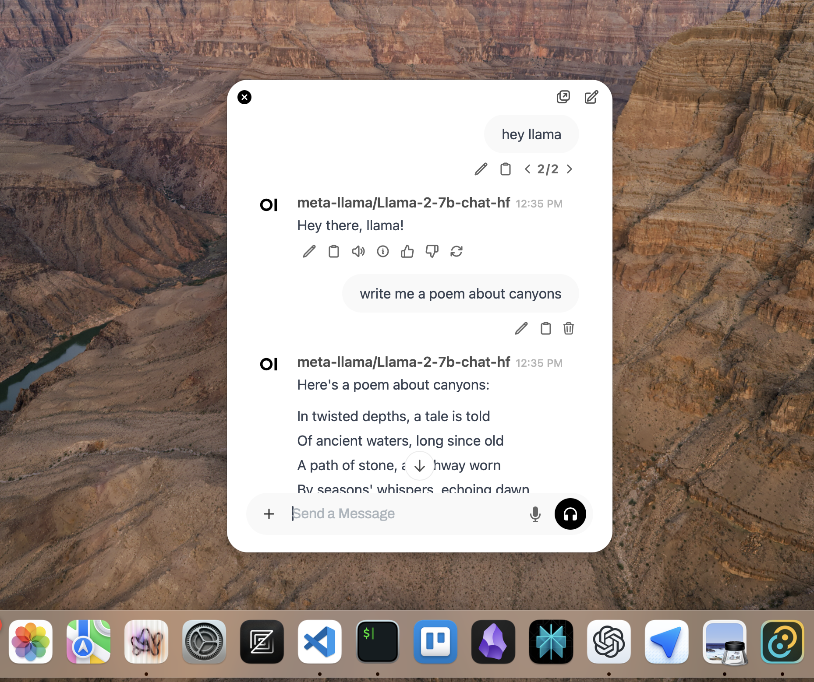
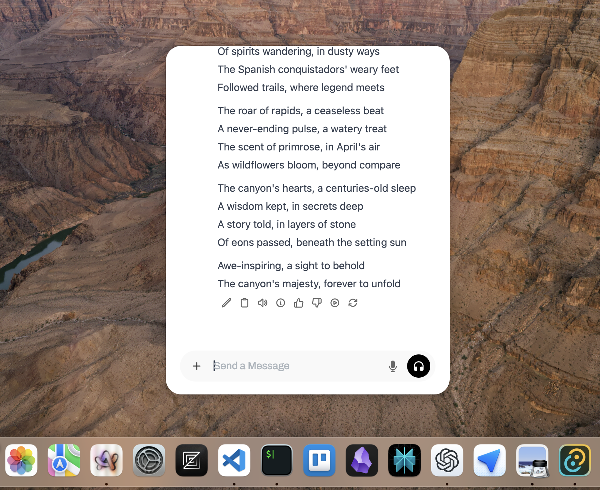

# Open WebUI Desktop

  
### 🎉 First Release Available! 
### v0.1.0 is now available for Mac OS - [Download Here](https://github.com/reecelikesramen/open-webui-desktop/releases/tag/v0.1.0)

 

**Status: Early Development and WIP**  

Open WebUI Desktop is a desktop application for [Open WebUI](https://github.com/open-webui/open-webui), a popular self-hosted LLM WebUI. Built using Tauri 2, it incorporates Svelte-based front-end code from Open WebUI to deliver a seamless desktop experience.

---

## Screenshots

### Desktop GUI

 
A panel-inspired interface for Open WebUI on the desktop.

### Chatbar

  
 
An always-on-top ChatGPT and Spotlight-inspired chatbar.

- **Global hotkey:** Customizable, defaults to `Ctrl+Space`.
- **Hide behavior:** Press `Esc` or shift focus to hide the chatbar.
- **Position options:** Several preset positions to appear, or remeber the last.

### Chat Companion

  
 
The Chat Companion displays recent chat activity:

- **Message persistence:** Keeps chats available for 10 minutes after the last message.
- **Position retention:** The companion remembers its location on the screen.

---

## Dev Installation

### Prerequisites

Ensure you have the following installed:

- **Rust** (latest stable version)
- **Python 3.11** (configured for a virtual environment)
- **Node.js** with a package manager (e.g., npm or deno)

### Steps

1. Clone this repository.
2. Run `npm run tauri dev` or `deno task tauri dev` to initiate the first-time build process (this may take some time).
3. Once the app is built, launch it. You should see the Open WebUI setup screen.
4. Connect your instance by inputting the base URL and logging in.

---

## Features

- **Open WebUI Desktop**: A desktop app with a main window hosting Open WebUI.
- **Chatbar**: A floating window for chat interactions.
- **Hotkey Support**: Toggle the chatbar with a customizable hotkey.
- **Chat Companion**: A persistent, floating window displaying recent chat activity.
- **Customizable App Settings**:
  - Global hotkey configuration
  - Companion chat settings
  - Chatbar position adjustments
- **Non-local Setup Support**: Enable compatibility with remote backend configurations.

## Roadmap

The following features and improvements are planned, roughly in order of priority:

1. **Full Desktop Integration**: Expand Open WebUI to interact with the computer and its apps.
1. **Platform-Specific Styling**: Align with design guidelines for macOS, Windows, and Linux (e.g., NSPanel, window effects).
1. **Distribution**: Package the application for easy distribution.
1. **System Integrations**: Mirror useful features from ChatGPT Desktop, such as clipboard management, screenshots, and app context integration.

---

## Contributing

Contributions are welcome! While formal guidelines are not yet in place, I will review and integrate useful contributions quickly. Feel free to open issues or submit pull requests.

---

## License

This project is licensed under the MIT License, with extensions from Open WebUI's license. For details, see the [LICENSE](./LICENSE) file.
